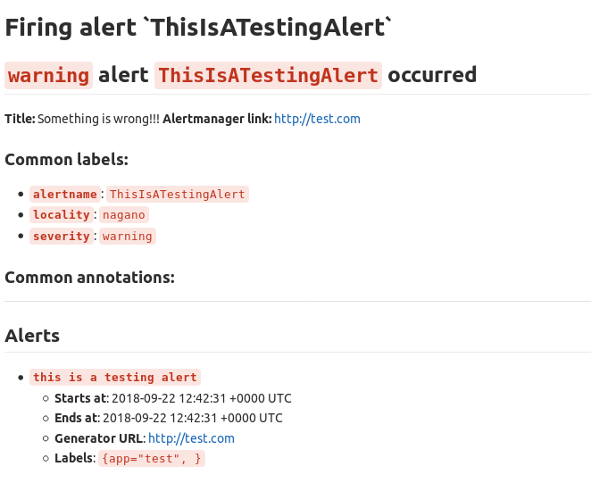

# Prometheus Gitlab Notifier

[](https://github.com/FUSAKLA/prometheus-gitlab-notifier/actions)
[](CHANGELOG.md)
[](https://cloud.docker.com/repository/docker/fusakla/prometheus-gitlab-notifier)

Tool which implements [Alertmanager](https://github.com/prometheus/alertmanager) webhook notifier
and creates Gitlab issue based on the the alert. It allows you to define own issue template using the Go template, labeling scheme
of the resulting issue and group the alerts to a singe issue to avoid flooding yourself with identical issues.

> This is probably possible in the Ultimate version of GitLab using
> the [Prometheus integration](https://docs.gitlab.com/ee/user/project/integrations/prometheus.html#setting-up-alerts-for-prometheus-metrics-ultimate),
> so if you have the possibility maybe first try that.

For new features or changes check out the [CHANGELOG.md](./CHANGELOG.md)

### How to run it
```
$ ./prometheus-gitlab-notifier --help
usage: prometheus-gitlab-notifier --gitlab.url=GITLAB.URL --gitlab.token.file=GITLAB.TOKEN.FILE --project.id=PROJECT.ID [<flags>]

Web server listening for webhooks of alertmanager and creating an issue in Gitlab based on it.

Flags:
  --help                         Show context-sensitive help (also try --help-long and --help-man).
  --debug                        Enables debug logging.
  --server.addr="0.0.0.0:9629"   Allows to change the address and port at which the server will listen for incoming connections.
  --gitlab.url=GITLAB.URL        URL of the Gitlab API.
  --gitlab.token.file=GITLAB.TOKEN.FILE  
                                 Path to file containing gitlab token.
  --project.id=PROJECT.ID        Id of project where to create the issues.
  --group.interval=1h            Duration how long back to check for opened issues with the same group labels to append the new alerts to (go duration syntax allowing 'ns', 'us' , 'ms', 's', 'm', 'h').
  --issue.label=ISSUE.LABEL ...  Labels to add to the created issue. (Can be passed multiple times)
  --dynamic.issue.label.name=DYNAMIC.ISSUE.LABEL.NAME ...  
                                 Alert label, which is to be propagated to the resulting Gitlab issue as scoped label if present in the received alert. (Can be passed multiple times)
  --issue.template=conf/default_issue.tmpl  
                                 Path to the issue golang template file.
  --queue.size.limit=100         Limit of the alert queue size.
  --retry.backoff=5m             Duration how long to wait till next retry (go duration syntax allowing 'ns', 'us' , 'ms', 's', 'm', 'h').
  --retry.limit=5                Maximum number of retries for single alert. If exceeded it's thrown away.
  --graceful.shutdown.wait.duration=30s  
                                 Duration how long to wait on graceful shutdown marked as not ready (go duration syntax allowing 'ns', 'us' , 'ms', 's', 'm', 'h').
```

To test it is running check logs or http://0.0.0.0:9629/readiness

### Try it out
You can send a test alert to it using the prepared alert JSON by running thin in root of this repo
```bash
curl -X POST -H "Content-Type: application/json" -d @./conf/alert.json http://localhost:9629/api/alertmanager
```

### Issue template
Look of the resulting issue in Gitlab can be customized using [Go template](https://golang.org/pkg/text/template/).
Default template can be found in [conf/default_issue.tmpl](conf/default_issue.tmpl).
The available data during templating is the Alertmanager webhook message struct itself.
Example can be found in [conf/alert.json](conf/alert.json).
To use own template override the default one with the `--issue.template` flag.
> The template is validated on startup but if even after validation the templating
fails in the runtime, raw JSON of the alert will be pasted to the text of the issue as a fallback.

Example of the default template:



### Configure Alertmanager
You just need to add the [`<webhook_config>`](https://prometheus.io/docs/alerting/configuration/#webhook_config)
receiver to your Alertmanager configuration and disable sending resolved notifications with `send_resolved: false`.
Also better to set the `repeat_interval` to higher value.

See the minimal example in the [conf/alertmanager_conf.yaml](conf/alertmanager_conf.yaml).


### Issue labeling scheme
The Gitlab notifier allows to label the resulting issue based on the alert labels.
It uses mostly Gitlab scoped labels in format `label::value`.
The grouping labels of the alert are added to the issue automatically to allow identifying same 
alerts (more on that in [Grouping](#Grouping) section).
Additionally, you can specify names of labels to be also added to the issue using flag `--dynamic.issue.label.name`.
Last thing you can add are static labels which will be added to every issue using flag `--issue.label`,


### Grouping
To avoid flooding gitlab with identical alerts if they happen to fire and resolve again and again, 
Gitlab notifier checks for issues witch the same grouping labels as the new incoming alert.
If if it finds any still open issue younger than `1h` by default (can be controlled by flag `--group.interval`),
it only appends the rendered template to the end of the issue description 
and adds to the issue label `appended-alerts::<number>` witch count of how many times it was updated. 


### Deployment
Example kubernetes manifests can be found at [kubernetes/](./kubernetes)


### Instrumentation

- `/liveness`: liveness endpoint returns always 200
- `/readiness`: tries HEAD request to the configured Gitlab URL and fails if it does not succeeds. 
- `/metrics`: metrics endpoint returning app runtime metrics in Prometheus format

### How to contribute and release

**Contributing:**
1. Implement your changes and test them on your own testing repository.
1. Add note about changes made to the [CHANGELOG.md](CHANGELOG.md) `Unreleased` section.
1. Create PR and apply for CR from maintainers.
1. Get it merged.
